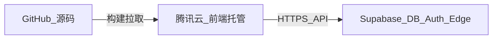

# TerraMar 官网上线流程（腾讯云前端 + Supabase）

本文对应「GitHub / Vercel / Cloudflare / Supabase」分工：**GitHub 存代码**；**前端**可选用腾讯云、Cloudflare Pages、Vercel 等其一；**Supabase** 提供数据库、鉴权与 Edge Functions。仓库根目录须包含 **`wrangler.toml`**（与 `package.json` 同级、**必须提交到 Git**）：`[assets]` 含 **`directory = "dist"`** 与 **`not_found_handling = "single-page-application"`**。若 CI 里仍出现「Detected Project Settings / Create wrangler.jsonc」且 `assets` 无 `directory`，说明 **Cloudflare 构建目录下没有读到该文件**（未推送、分支不对，或 **Root directory** 未指向含 `wrangler.toml` 的子目录）；**不要**再在 `public/_redirects` 使用 `/* /index.html 200`，否则会与 `not_found_handling` 叠加导致 Cloudflare 报「Infinite loop」部署失败。

**推荐 Deploy 命令**：`npm run deploy`（即 `wrangler deploy --config wrangler.toml`），以便使用 `npm ci` 安装到 **node_modules** 的 Wrangler，避免 `npx` 另装一份再跑自动脚手架。若坚持用 `npx wrangler deploy`，须保证仓库里已有 **`wrangler.toml`** 且 **`package-lock.json` 含 wrangler**（`npm ci` 后 `node_modules/.bin/wrangler` 存在）。

## 架构关系（简图）

## 1. 腾讯云：前端与自定义域名（待办：domain-tencent）

1. 在腾讯云控制台（Web 应用托管 / EdgeOne Pages 等，以你项目实际产品为准）确认：
   - 已关联 **GitHub** 仓库与部署分支（如 `main`）。
   - **构建命令**：`npm install`（或 `npm ci`）+ `npm run build`。
   - **输出目录**：`dist`（与 [package.json](../package.json) 中 Vite 默认一致）。
2. **自定义域名与 HTTPS**  
   - 在控制台「添加自定义域名」，按向导完成 **DNS 解析** 与 **SSL 证书**（大陆访问常涉及 **ICP 备案**，以腾讯云与法规要求为准）。  
   - 未备案时，预览域名可能仅适合测试；正式对公服务请按控制台提示完成备案与证书。
3. **腾讯云「环境变量 / 构建变量」**（名称以控制台为准）至少配置：
   - `VITE_SUPABASE_URL` = Supabase **Project URL**（不含 `/rest/v1` 后缀）。
   - `VITE_SUPABASE_ANON_KEY` = Supabase **anon public** 密钥（**禁止**使用 `service_role`）。
   - 可选：`VITE_USE_MOCK_AUTH=false`（确保生产走真实登录）。
4. **与支付一致的前端根地址**  
   - 用户最终访问的 **HTTPS 根地址**（如 `https://www.example.com`）须与 Supabase Edge 密钥 **`PUBLIC_SITE_URL`** 一致（见下文），否则支付完成后的 `return_url` 会跳错站。

### 1b. Cloudflare Pages / Wrangler（若用 Cloudflare 部署）

1. **构建**：`npm ci`（或 `npm install`）+ `npm run build`，产物目录为 **`dist`**（与 [wrangler.toml](../wrangler.toml) 中 `[assets].directory` 一致）。  
2. **Wrangler 报错「`assets` 缺少 `directory`」**：在 GitHub 网页确认 **`wrangler.toml` 与更新后的 `package-lock.json` 已在默认分支**；Cloudflare **Root directory** 若为 monorepo 须设为 **`terramar-website`**（或实际含 `wrangler.toml` 的路径）。部署须在 **`npm run build` 之后**执行 **`npm run deploy`**（推荐）或 `npx wrangler deploy --config wrangler.toml`。  
3. **依赖**：`package.json` 含 **`wrangler`** `devDependency`；**务必推送 `package-lock.json`**，否则 `npm ci` 不会安装 Wrangler，`npx wrangler` 会临时下载并可能再次触发不完整的自动配置输出。  
4. **Pages 控制台**（若用 Git 集成而非仅 Wrangler）：**Build output directory** 填 `dist`；**Root directory** 若仓库为 monorepo 则指向含 `package.json` 的子目录（如 `terramar-website`）。  
5. **环境变量**：在 Cloudflare 项目设置中配置与腾讯云相同的 `VITE_SUPABASE_URL`、`VITE_SUPABASE_ANON_KEY`（构建时注入）。  
6. **SPA 路由**：依赖 `wrangler.toml` 中 **`not_found_handling = "single-page-application"`**，勿在 `dist` 中再保留与上述冲突的 **`_redirects`** 规则。

## 2. Supabase：生产环境与支付（待办：supabase-prod）

1. **数据库**  
   - 确认生产库已应用全部所需迁移；支付相关列见 [../supabase/migrations/20260506120000_orders_zpay_payment_meta.sql](../supabase/migrations/20260506120000_orders_zpay_payment_meta.sql)。  
   - 若 CLI `db push` 与远程历史不一致，可在 Dashboard **SQL Editor** 执行等价 SQL（你此前已采用的做法）。
2. **Authentication → URL configuration**  
   - **Site URL**：填正式前端根地址（与 `PUBLIC_SITE_URL` 一致）。  
   - **Redirect URLs**：加入正式域名下的登录回调路径（如 `https://www.example.com/**` 按 Supabase 文档填写允许列表）。
3. **Edge Functions**（项目目录 [../supabase/functions/](../supabase/functions/)）  
   - 部署：`create-pay-session`、`pay-notify`。  
   - **Secrets**（示例）：`ZPAY_PID`、`ZPAY_KEY`、`PUBLIC_SITE_URL`（与浏览器访问根地址一致，无尾斜杠）、可选 `ZPAY_SITENAME`。  
   - `pay-notify` 需在 z-pay 商户后台配置为：  
     `https://<project-ref>.supabase.co/functions/v1/pay-notify`
4. **国内外访问说明**  
   - 前端经腾讯云全球加速，一般对国内外用户较友好。  
   - 浏览器仍会直连 **`*.supabase.co`**；若 Supabase 区域在境外，部分国内网络可能出现慢或不稳定，属基础设施限制。若需大陆合规或极致稳定，需另行评估专线/代理/API 网关等方案（超出本文最小范围）。

## 3. GitHub

- 职责：**版本与协作**；腾讯云从 GitHub 拉代码构建时，**用户访问网站不需要打开 GitHub**。  
- 国内 `git push` 若不稳定，可使用 VPN/代理或 GitHub Desktop；不影响云端已关联仓库的自动构建（以腾讯云配置为准）。

## 4. 上线验收（待办：e2e-auth-pay）

在 **正式 HTTPS 域名**（非仅 localhost）下逐项确认：

| 步骤 | 预期 |
|------|------|
| 打开首页与主要页面 | 无白屏、资源加载正常 |
| 注册/登录 | Supabase Auth 成功，会话保持 |
| 下单 | `orders` 写入，`amount_cny` 正确 |
| 待付款 → 去支付 | 跳转 z-pay，金额与订单一致 |
| 支付完成（或沙箱） | z-pay 异步通知后订单 `status` 为 `pending_fulfillment`，`payment_notified_at` 有值 |
| 伪造错误 sign 的 notify | 订单不变，`pay-notify` 返回 `fail`（查 Edge Logs） |

## 5. 小结表（填表用）

| 问题 | 当前架构下的答案 |
|------|------------------|
| 代码托管 | GitHub |
| 网站页面（HTML/JS）托管 | 腾讯云（具体产品名以控制台为准） |
| 数据库、登录、支付 Edge | Supabase |
| Vercel / Cloudflare | 非必需；仅为可选前端托管替代方案 |
