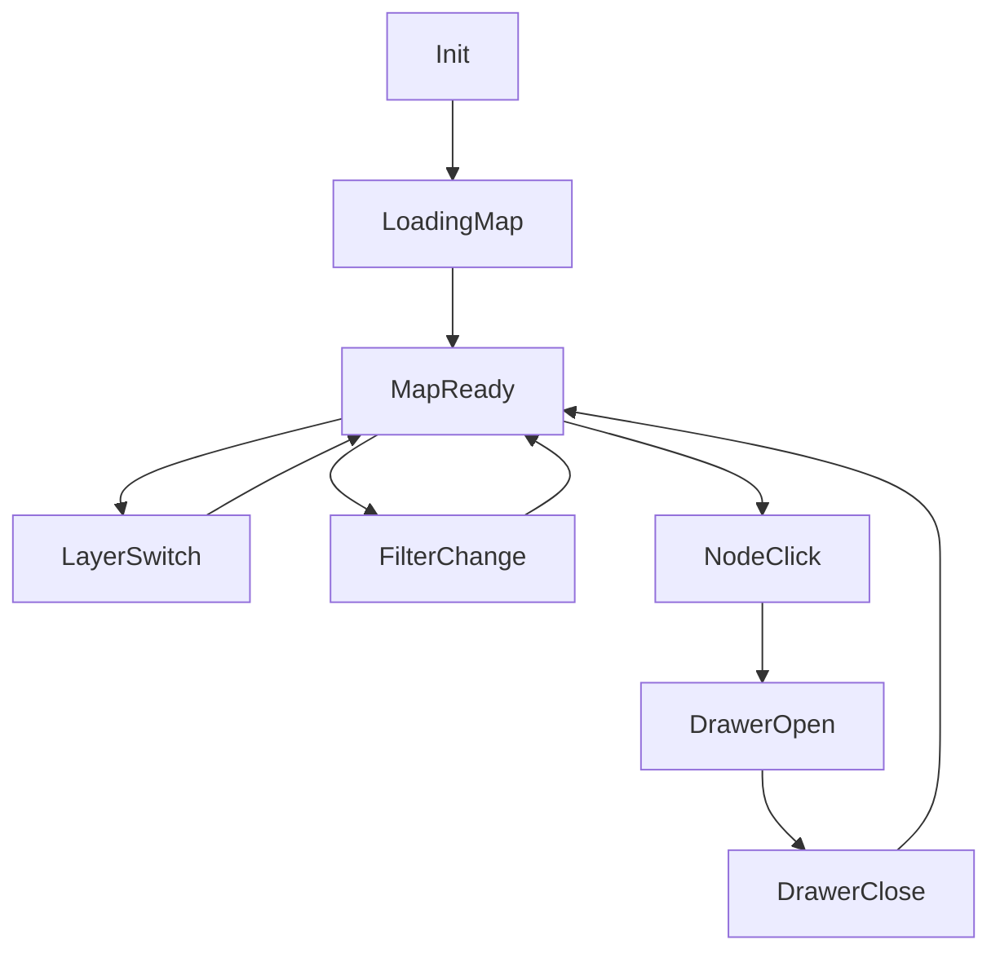
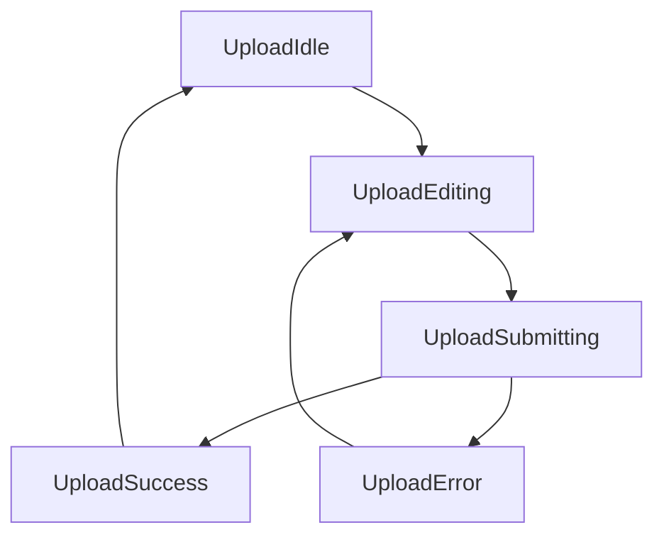

# TerraMar 四页首屏地图数据平台设计文档 v1.0

文档类型：产品 + 交互 + 前端落地规格  
适用范围：`/programs`、`/cooperation`、`/impact`、`/science` 四个页面首屏  
实现阶段：MVP 半交互型（含科研页“上传入口原型流程”，前端假提交）  
视觉策略：卫星底图 + 热力/点位层  
关联文档：`docs/PRD_TerraMar_Web_MVP.md`、`frontend/docs/PRD_TerraMar_Web_MVP_v2_optimized.md`、商业计划书（山海自然教育）

---

## 1. 产品目标与业务依据

## 1.1 平台目标
- 把四个业务页面的首屏从“静态视觉”升级为“可探索的数据入口”。
- 用地图把 TerraMar 的四条线（活动、合作、公益、科研）连接成统一叙事：
  - **活动**：谁在参与、从哪里来、如何形成社群网络
  - **合作**：哪些机构在共建、网络关系和合作强度如何
  - **公益**：栖息地、社区、学校覆盖范围和触达效应
  - **科研**：物种记录与公民科学参与如何沉淀为可持续数据

## 1.2 商业计划书关键信号（用于地图平台口径）
- **战略定位**：保护地导向 + B/C/G 并行 + 公益与科研融合。
- **核心场景**：钱江源示范项目地，后续“城市-保护地双核”与多核扩展。
- **合作对象**：学校、保护地、企业 ESG、科普馆/景区、公益基金会。
- **公益方向**：保护地课程、社区项目、公众传播项目。
- **科研方向**：公民科学（蝴蝶监测、鸟类调查、物候记录、溪流水质等）。
- **指标导向**：服务人次、机构数、志愿者数、有效记录数、样线样点、触达规模。

## 1.3 MVP 边界
- 做：地图展示、筛选、详情抽屉、基础指标、科研页上传原型流程（假提交）。
- 不做：真实地图后台、真实上传审核、真实数据入库、权限系统、数据纠错工单。

---

## 2. 总体体验与信息架构

## 2.1 首屏统一结构
四页首屏统一采用 `MapHero` 结构，确保品牌一致性与开发复用。

1. `MapHeroShell`：首屏容器（全屏高度，承载地图和文案）
2. `MapLayerSwitcher`：图层切换器（卫星/热力/点位）
3. `MapFilterBar`：筛选条（页面定制）
4. `MapInsightPanel`：关键指标卡（4-6个）
5. `MapDetailDrawer`：点位详情抽屉
6. `MapPrimaryCTA`：页面主行动按钮
7. `MapUploadEntry`：仅科研页显示上传入口

## 2.2 统一交互规则
- 默认进入页面后 200ms 内先显示骨架，再加载地图层。
- 所有图层切换都保持视角不跳变（除首次定位）。
- 点击点位/网格进入详情抽屉，抽屉中提供下一步 CTA。
- 筛选项变化触发指标重算和图层重绘。
- 移动端优先：地图全宽，筛选折叠为抽屉式过滤面板。

---

## 3. 四页首屏地图规格（可直接给设计与前端）

## 3.1 `/programs` 探索活动：参与群体网络图

### 地图目标
- 展示“参与者来源地 -> 项目地（钱江源/其他）”的参与流向。
- 体现亲子、成人、银发、科研志愿者的参与结构。

### 默认图层
- 卫星底图（浅暗化）
- 来源热力层（城市级）
- 项目地点位层

### 筛选项
- 时间：近30天 / 本季 / 全年
- 人群：亲子 / 成人 / 银发 / 科研志愿者
- 活动类型：half_day / weekend / camp / adult_healing / senior / citizen_science
- 主题：森林 / 溪流 / 观鸟 / 植物 / 科考 / 疗愈

### 指标卡
- 累计参与人数
- 活跃来源城市数
- 复购参与率（mock）
- 社群活跃群组数（mock）

### 点位详情字段
- 点位名称（城市或活动地）
- 活动场次
- 参与人次
- 主人群标签
- 近30天趋势（mock sparkline 占位）

### CTA
- 主 CTA：查看活动列表
- 次 CTA：订阅下期活动

---

## 3.2 `/cooperation` 合作共建：机构协作网络图

### 地图目标
- 把“学校/保护地/企业 ESG/科普馆/景区”转为可见机构网络。
- 支持按合作类型查看网络密度与覆盖范围。

### 默认图层
- 卫星底图
- 机构点位层（按机构类型颜色分组）
- 区域热力层（合作活跃度）

### 筛选项
- 机构类型：学校 / 保护地 / 企业 / 科普馆 / 景区
- 合作类型：课程 / 培训 / ESG / 公众教育 / 联合传播
- 区域：长三角 / 华南 / 华北 / 西南（MVP 可先仅长三角）
- 项目状态：洽谈中 / 执行中 / 已结项

### 指标卡
- 合作机构总数
- 在执行项目数
- 覆盖城市数
- 机构续约率（mock）

### 点位详情字段
- 机构名称
- 类型
- 在执行项目
- 最近合作时间
- 可交付标签（课程包、培训、传播等）

### CTA
- 主 CTA：发起合作咨询
- 次 CTA：查看合作案例（占位）

---

## 3.3 `/impact` 公益行动：栖息地-社区-学校覆盖图

### 地图目标
- 展示公益项目如何覆盖“栖息地、社区、学校”。
- 强化公益影响力和参与路径，而非募捐广告感。

### 默认图层
- 卫星底图（可暖色滤镜）
- 覆盖区块层（栖息地/社区/学校）
- 公益项目点位层
- 触达热力层（服务人次/活动触达）

### 筛选项
- 公益类型：保护地课程 / 社区项目 / 公众传播 / youth_access
- 受益对象：儿童 / 家庭 / 社区居民 / 志愿者
- 状态：规划中 / 执行中 / 已完成
- 参与方式：志愿者 / 伙伴机构 / 场地 / 资金支持

### 指标卡
- 公益服务人次
- 覆盖社区数
- 覆盖学校数
- 志愿者人数
- 传播触达（可选）

### 点位详情字段
- 项目名称
- 覆盖类型（栖息地/社区/学校）
- 受益对象
- 服务数据（人次/场次）
- 参与需求标签

### CTA
- 主 CTA：参与公益行动
- 次 CTA：申请社区合作

---

## 3.4 `/science` 科研与公民科学：生物多样性记录图

### 地图目标
- 展示公民上传记录如何形成物种观察数据库。
- 支持按物种类群、时间、地点查看记录分布与趋势。

### 默认图层
- 卫星底图
- 物种记录点位层（聚合）
- 物种热力层（记录密度）
- 样线样点层（简化线段/标记）

### 筛选项
- 物种类群：birds / insects / plants / water / mammals / phenology
- 时间：近7天 / 近30天 / 本季 / 全年
- 数据质量：待核验 / 已核验（MVP mock）
- 参与级别：beginner / trained / advanced

### 指标卡
- 有效记录数
- 参与者人数
- 样线/样点数
- 年度报告数量
- 热点物种数（可选）

### 点位详情字段
- 记录编号
- 物种名（中/英）
- 观测时间
- 记录者类型
- 图片缩略图
- 核验状态

### CTA
- 主 CTA：加入公民科学
- 次 CTA：下载记录模板

---

## 4. 科研页上传入口原型（半交互 MVP）

## 4.1 上传流程（前端假提交）
1. 点击“上传物种记录”
2. 填写表单：
   - 物种名称（文本）
   - 类群（枚举）
   - 拍摄时间（日期时间）
   - 坐标（自动/手动输入）
   - 图片（本地上传，仅前端预览）
   - 备注（可选）
3. 提交后：
   - 展示“提交成功，待核验”状态
   - 记录写入 localStorage/mock store
   - 地图新增一个“待核验”点位（当前会话可见）

## 4.2 交互状态
- `idle`：未操作
- `editing`：填写中
- `submitting`：提交中（按钮 loading）
- `success`：成功提示 + 跳转点位定位
- `error`：提示重试（模拟失败分支）

## 4.3 合规提示（MVP 文案）
- “请勿上传受保护物种敏感巢址精确位置。”
- “上传内容仅用于自然教育与公民科学研究用途。”

---

## 5. 数据模型（TypeScript，可直接复用）

```ts
export type MapPageType = "programs" | "cooperation" | "impact" | "science";

export type GeoPoint = {
  id: string;
  lng: number;
  lat: number;
  city?: string;
  province?: string;
};

export type MapNode = {
  id: string;
  page: MapPageType;
  nodeType: "activity_site" | "source_city" | "institution" | "habitat" | "community" | "school" | "species_record";
  name: string;
  location: GeoPoint;
  tags: string[];
  metrics?: { label: string; value: string | number }[];
  status?: "planning" | "active" | "completed" | "pending_review" | "verified";
};

export type MapEdge = {
  id: string;
  page: MapPageType;
  fromNodeId: string;
  toNodeId: string;
  relationType: "participation_flow" | "co_build" | "service_coverage" | "observation_route";
  strength?: number; // 1-5
  label?: string;
};

export type MapMetric = {
  page: MapPageType;
  key: string;
  label: string;
  value: string | number;
  trend?: "up" | "down" | "flat";
};

export type SpeciesObservation = {
  id: string;
  speciesNameCn: string;
  speciesNameEn?: string;
  topic: "birds" | "insects" | "plants" | "water" | "mammals" | "phenology";
  imageUrl?: string;
  observedAt: string; // ISO
  location: GeoPoint;
  observerType: "family" | "volunteer" | "student" | "research_partner";
  verificationStatus: "pending_review" | "verified" | "rejected";
  sourceProjectSlug?: string;
};
```

## 5.1 建议新增 mock 文件
- `src/mock/map/mapNodes.ts`
- ~~`src/mock/map/mapEdges.ts`~~（已移除；关系线功能下线）
- `src/mock/map/mapMetrics.ts`
- `src/mock/map/speciesObservations.ts`
- `src/mock/map/mapFilters.ts`

## 5.2 与现有数据映射
- `programs.ts` -> 生成 `activity_site` 节点和活动筛选元数据
- `partners.ts` -> 生成 `institution` 节点
- `impactProjects.ts` -> 生成 `habitat/community/school` 节点与覆盖关系
- `scienceProjects.ts` -> 生成 `observation_route` 关系与指标
- `metrics.ts` -> 首屏指标卡初始值

---

## 6. 组件与前端落地建议

## 6.1 文件落点
- `src/components/map/MapHeroShell.tsx`
- `src/components/map/MapLayerSwitcher.tsx`
- `src/components/map/MapFilterBar.tsx`
- `src/components/map/MapInsightPanel.tsx`
- `src/components/map/MapDetailDrawer.tsx`
- `src/components/map/MapUploadEntry.tsx`（science only）
- `src/features/map/useMapFilters.ts`
- `src/features/map/useMapMetrics.ts`

## 6.2 渲染策略（MVP -> 迭代）
- MVP：静态卫星底图图片 + SVG/Canvas 覆盖层（点、线、热区模拟）。
- v2：接入 MapLibre/Mapbox/高德 WebGL，替换覆盖层实现。
- v3：后端数据服务 + 分层权限（公开层/合作层/研究层）。

## 6.3 响应式策略
- 桌面：地图 + 右侧/浮动指标卡 + 抽屉详情
- 平板：地图主视图，筛选折叠
- 移动：地图全宽，筛选和详情采用 bottom sheet

---

## 7. 事件埋点规范（新增）

| 事件名 | 触发时机 | 页面 |
|---|---|---|
| `view_map_hero` | 首屏地图加载完成 | 四页 |
| `toggle_map_layer` | 切换图层 | 四页 |
| `change_map_filter` | 变更任一筛选项 | 四页 |
| `click_map_node` | 点击地图点位/热区 | 四页 |
| `open_detail_drawer` | 打开详情抽屉 | 四页 |
| `click_map_cta` | 点击首屏 CTA | 四页 |
| `open_species_upload` | 打开上传入口 | `/science` |
| `submit_species_mock` | 提交上传原型成功 | `/science` |
| `submit_species_mock_fail` | 提交上传原型失败 | `/science` |

埋点 payload 建议字段：
- `page`, `layer`, `filterState`, `nodeType`, `nodeId`, `projectSlug`, `topic`, `timeRange`

---

## 8. 状态机（实现建议）



科研上传子状态机：



---

## 9. UI/交互细节（首屏嵌入规范）

- 首屏高度：`min(100vh, 860px)` 桌面；移动端 `70vh-82vh`
- 地图层透明遮罩：保证标题与导航可读
- 指标卡位置：右上浮层（桌面），底部横滑（移动）
- 抽屉宽度：桌面 420-480px；移动底部 65%-80% 高度
- 动效：层切换 200ms，抽屉进出 240ms，点位 hover 120ms

---

## 10. 分阶段交付路线图

## Phase 1（1周）：地图展示 MVP
- 四页首屏地图容器 + 图层切换 + 筛选 + 指标卡 + 详情抽屉
- 全部使用 mock 数据

## Phase 2（第2周）：半交互增强
- `/science` 上传入口原型 + 假提交 + 新点位即时可见
- 新增埋点事件与基础看板字段

## Phase 3（后续）：真实平台化
- 接入真实地图 SDK 与后端 API
- 增加记录审核流、数据质量分级、机构协作权限
- 形成“年度影响力 + 生物多样性专题报告”数据资产

---

## 11. 验收标准（文档与实现准备度）

- 四页均有明确：地图目标、默认图层、筛选、指标、详情字段、CTA。
- 数据模型可直接用于 TypeScript mock 文件落地。
- 科研页上传原型流程闭环清晰，可前端独立实现。
- 埋点覆盖“浏览-筛选-点击-提交”完整行为链。
- 明确 MVP 与真实平台边界，避免范围失控。

