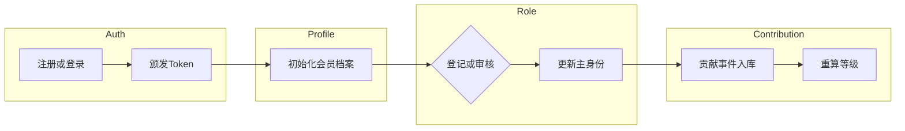

# PRD｜山海云登录与会员体系（v1 草案）

文档版本：v1.0（草案）  
关联文档：[API_Shanhaiyun_User_Membership_contract_v0.md](./API_Shanhaiyun_User_Membership_contract_v0.md)  
前置说明：山海云数据平台身份能力当前为 **绿场**（先定契约与标准，再实现）；个人会员等级以 **贡献度** 累计为主；机构会员 **不细分子类型**。  
与官网 MVP 关系：见 [PRD_TerraMar_Web_MVP.md](./PRD_TerraMar_Web_MVP.md) 演进说明；本文 **不替代** MVP v1.0 对历史交付的约束描述。

---

## 1. 文档定位与读者

| 角色 | 用途 |
|------|------|
| 产品 | 范围、分期、验收、与现有页面映射 |
| 山海云后端 | 领域模型、事件、接口契约对齐 |
| 官网前端（`terramar-website`） | 登录态、写接口调用、降级策略 |
| 运营 / 法务 | 权益说明、隐私与同意 |

---

## 2. 产品愿景与原则

### 2.1 一句话愿景

用户在山海自然教育官网完成登录后，**身份、会员画像、行为与业务数据** 均以 **山海云用户主键** 沉淀；**官网不作为权威数据源**（仅会话缓存、离线降级与演示模式除外）。

### 2.2 设计原则

1. **单一用户主键**：`shanhaiyun_user_id`（UUID 或平台约定主键）贯穿线索、活动报名、公民科学记录、志愿行为、会员等级。
2. **身份与会员等级解耦**  
   - **身份标签**：`游客` / `志愿者` / `公民科学家` — 表达参与方式与权限边界。  
   - **会员等级**：由贡献事件累计得分映射等级（如 L1–L5 或运营命名），表达权益与荣誉。  
3. **机构会员单档**：不细分子类型，用 **机构档案** 承载差异（名称、证照/备案号、对接人、合作范围等）。
4. **认证可演进**：P1 可采用自建账号 + Bearer Token；中长期可接入 OIDC / 微信等，**迁移不得破坏用户主键**。

---

## 3. 用户与会员模型

### 3.1 个人用户（Individual）

| 概念 | 说明 |
|------|------|
| **账号** | 山海云 `users` 实体；登录标识支持手机或邮箱（P1 二选一为主路径，另一项可选绑定）。 |
| **身份标签** | `游客`（默认）、`志愿者`、`公民科学家`。是否允许多身份并存由平台定 **v1 建议**：单一 **主身份** + 历史审计；解锁志愿者/公民科学家需完成登记或审核流程。 |
| **会员等级（贡献制）** | 由 `contribution_events` 汇总加权得分 `level_points`，映射 `level`；建议等级名由运营配置表维护。 |

**贡献度 v1 建议指标（可配置权重）**

| 事件类型 | 说明 | 防刷要点 |
|----------|------|----------|
| 有效物种/自然记录入库 | 经审核通过或自动规则通过 | 重复提交去重、同一物种短时间窗口上限 |
| 志愿 / 服务时长 | 签到签退或合作方回写 | 地理围栏或活动主理人确认 |
| 观测核验率 | 已核验 / 提交总量 | 低质量高频降权 |
| 连续活跃 | 滚动窗口内有登录或有效贡献 | 与登录日志关联 |

**升降级**：建议 **T+1 批处理** 重算等级 + 关键节点（跨级）**实时通知**；是否允许降级为可选策略（默认仅升级不降级，或年度复审）。

### 3.2 机构用户（Organization）

- **会员类型**：统一 `ORG_MEMBER`（不细分子类型）。
- **机构档案**：法人/民办非企业名称、统一社会信用代码或备案号、对接人、合作范围标签、认证状态（待审/已认证）。
- **一期明确不做**：机构子账号与多级权限（列入二期 backlog）。

### 3.3 未登录与匿名线索

- 未登录可浏览公开内容；留资可写入山海云 **弱线索**（`lead`），并关联 `anonymous_session_id`（Cookie 或设备指纹策略由安全评审定）。
- 用户登录后执行 **线索合并**：同一手机/邮箱优先；冲突时以最新同意为准并留审计记录。

### 3.4 登录后默认身份

- 默认主身份：`游客`。  
- `志愿者` / `公民科学家`：与现有官网 **统一登记** 产品对齐（`/join-network/personal?entry=…`），升级为 **已登录态** 下的资料完善与提交；写入山海云对应业务表，不再依赖浏览器独立 `localStorage` 库（演示环境见第 5 节降级）。

---

## 4. 核心用户旅程

### 4.1 注册 / 首次登录

创建 `users` + `user_profiles` + `membership_individual`（默认 `游客`、初始 `level` / `level_points`）。

### 4.2 身份解锁（志愿者 / 公民科学家）

用户完成登记表单与必要校验 → 写入身份审计 → 更新 `membership_individual.primary_role`（或 `roles`）→ 触发权益配置（如地图写权限、活动通道）。

### 4.3 贡献事件与等级

观测提交、志愿时长、课程完成等 → `contribution_events` 幂等写入 → 批处理重算 `level` → 可选站内信 / 短信（渠道策略另表）。

### 4.4 机构入驻

机构主账号注册 → 提交机构档案 → 运营审核 → `membership_organization` 状态更新。

### 4.5 流程图（Mermaid）

---

## 5. 功能范围与分期

| 阶段 | 登录 | 会员 | 数据入山海云 | 说明 |
|------|------|------|----------------|------|
| **P0 契约** | 无实现 | 模型与事件定稿 | OpenAPI/字段表 v0 | 与山海云团队对齐 [API 契约](./API_Shanhaiyun_User_Membership_contract_v0.md) |
| **P1 MVP** | 手机 OTP 或邮箱密码（二选一为主） | 个人三身份 + 贡献等级 v1 | 线索/登记/观测写 API | 官网 `src/lib/leads.ts`、`citizenScienceLeads.ts`、`shanhaiyunVolunteerLeads.ts` 改为 **演示降级**：无 Token 时仍写本地；有 Token 时写云 |
| **P2 增强** | OAuth / 微信等 | 等级算法迭代、机构子账号 | 画像与推荐 | 依赖山海云标准成熟 |

---

## 6. 领域对象（山海云侧建议）

> 表名为建议逻辑名，实际以山海云数据库设计为准。

| 实体 | 关键字段（示例） |
|------|------------------|
| `users` | `id`, `phone`, `email`, `status`, `created_at` |
| `user_profiles` | `user_id`, `display_name`, `avatar_url`, `region` |
| `membership_individual` | `user_id`, `primary_role`, `roles_json`, `level`, `level_points`, `level_updated_at` |
| `membership_organization` | `org_id`, `admin_user_id`, `org_profile_json`, `verification_status` |
| `contribution_events` | `id`, `user_id`, `event_type`, `payload_json`, `idempotency_key`, `occurred_at` |
| `leads` / `registrations` | 扩展 `user_id` 可空、`lead_type` 与现网 `LeadType` 对齐 |

**演示数据迁移**：默认 **不迁移** 浏览器 mock；可选提供「导出 JSON」工具（合规评估后）。

---

## 7. 与现有官网功能映射

| 现有能力 | 演进方向 |
|----------|----------|
| `/join-network/personal` + `entry` | 登录态下完成；提交写入山海云登记 API，保留 `entry` 语义（公益志愿 / 公民科学等） |
| `MapUploadEntry` 物种记录 | 提交须带 `user_id`；匿名模式仅演示或禁止写生产 |
| `LeadForm` 各页留资 | 统一 `lead` API，`user_id` 可空 |
| 埋点 `trackEvent` | 增加 `user_id` 哈希或分段 id（隐私评审） |

---

## 8. 非功能需求（摘要）

- **安全**：验证码限流、登录失败锁定策略、Token 存 **httpOnly Cookie**（推荐）优于 `localStorage`；HTTPS 全站。
- **隐私**：最小必要采集、同意记录版本号、用户导出与删除请求（响应 SLA）。
- **性能**：等级重算异步队列；热点读可走缓存并定义失效（可选 Webhook）。
- **可观测**：登录成功率、Token 刷新失败率、身份变更次数、等级跃迁漏斗。

---

## 9. 用户故事与验收标准（P1 节选）

### US-1 注册登录

- **作为** 新用户 **我希望** 用手机或邮箱注册并登录 **以便** 我的记录进入山海云。  
- **验收**：完成注册后返回有效 `access_token`；重复手机返回 409；错误密码返回 401。

### US-2 主身份与登记

- **作为** 已登录用户 **我希望** 从公益或科研入口进入登记 **以便** 我的主身份更新为志愿者或公民科学家。  
- **验收**：提交成功后山海云 `membership_individual` 与审计表一致；官网展示与入口权限变化。

### US-3 贡献与等级

- **作为** 公民科学家 **我希望** 提交观测后获得积分 **以便** 看到等级成长。  
- **验收**：`contribution_events` 幂等；次日批处理后等级与文案更新（若采用 T+1）。

### US-4 机构会员

- **作为** 机构对接人 **我希望** 注册机构账号并提交资料 **以便** 通过认证后开展合作。  
- **验收**：机构档案可保存为「待审」；运营审核后状态为「已认证」。

---

## 10. 开放问题（Backlog）

1. 主身份与多身份并存策略的最终规则。  
2. 未成年人账号与监护人同意流程是否纳入 P1。  
3. 山海云与第三方身份（微信）的优先级与绑定冲突处理。  
4. 机构子账号与 RBAC 的二期范围。

---

## 11. 修订记录

| 版本 | 日期 | 说明 |
|------|------|------|
| v1.0 | 2026-05 | 初稿，对齐官网演进与 API 契约 v0 |
