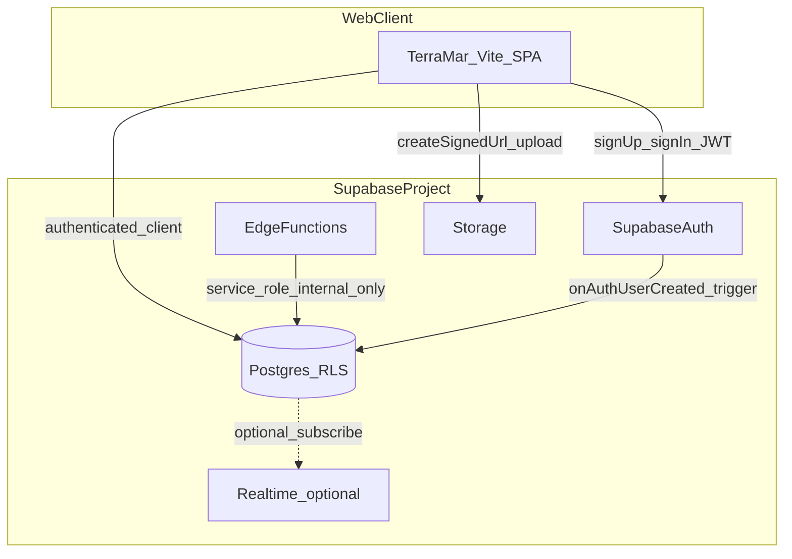

# TerraMar 官网后端产品文档（Supabase）v1

文档版本：v1.0  
适用范围：山海自然教育（TerraMar）官网 **正式后端与数据层** 的产品定义；落地栈为 **Supabase**（Postgres + Supabase Auth + RLS + 可选 Edge Functions / Storage / Realtime）。  
**不替代**下列文档，请交叉阅读：

| 文档 | 用途 |
|------|------|
| [PRD_TerraMar_Web_Product_Overview_v1.md](./PRD_TerraMar_Web_Product_Overview_v1.md) | 信息架构、路由、当前 mock 现状 |
| [PRD_TerraMar_Web_MVP.md](./PRD_TerraMar_Web_MVP.md) | MVP 边界、漏斗、演进 |
| [PRD_Shanhaiyun_Auth_Membership_v1.md](./PRD_Shanhaiyun_Auth_Membership_v1.md) | 身份、会员、贡献原则 |
| [API_Shanhaiyun_User_Membership_contract_v0.md](./API_Shanhaiyun_User_Membership_contract_v0.md) | REST 形状、幂等、错误码（本文给出 Supabase 映射） |
| [PRD_Account_Personal_Center_v1.md](./PRD_Account_Personal_Center_v1.md) | 个人中心、订单五态 |
| [Map_Data_Platform_Design_v1.md](./Map_Data_Platform_Design_v1.md) | 地图与节点语义（若存在） |

---

## 0. 文档约定与分期决策

### 0.1 文档形态（已定）

- **单文件产品文档**：本文同时承载 **产品需求、数据域、安全策略、验收分期**；**不**内嵌完整 SQL migration（实现阶段放入 `supabase/migrations` 或独立仓库，并可用 `TECH_` / ADR 补充）。
- **P0 范围（首期必交付）**：Supabase Auth + `profiles`、线索 `leads`、课程订单 `orders`（含五态枚举）、个人可读写的 **RLS 最小集**、与前端登录态对接。
- **P1**：贡献事件 `contribution_events`、累计积分与 Lv1–Lv10 等级 **服务端真源**、任务中心 `member_task_progress`、资源学习进度、物种观测主表与 Storage 附件。
- **P2**：支付/履约 Webhook、机构审核工作流、通知渠道（邮件/短信/站内信）、Realtime 推送。

### 0.2 读者

| 角色 | 用途 |
|------|------|
| 产品 | 范围、状态机、验收、与前端页面映射 |
| 后端 / 数据 | 表职责、约束、触发器与 Edge Function 边界 |
| 安全 | RLS、密钥、PII、审计 |
| 前端 | 替换 `mockAuthStore` / `localStorage` 的契约与降级策略 |

### 0.3 术语表（节选）

| 术语 | 含义 |
|------|------|
| `user_id` | 与 `auth.users.id` 一致的 UUID，全站业务外键主键 |
| RLS | Row Level Security，Postgres 行级安全策略 |
| PostgREST | Supabase 自动生成的 REST/GraphQL 接口层 |
| Edge Function | Deno 运行时，用于密钥、回调、跨表事务等 |
| 真源（Source of Truth） | 以服务端 Postgres 为准；浏览器仅缓存 |

---

## 1. 目标与非目标

### 1.1 目标

1. 用户通过 **Supabase Auth** 注册/登录后，**所有业务数据** 写入 Postgres，并可被 **RLS** 正确隔离。
2. **单一用户主键** `user_id` 贯穿线索、订单、贡献、观测、任务（对齐 [PRD_Shanhaiyun_Auth_Membership_v1.md](./PRD_Shanhaiyun_Auth_Membership_v1.md) §2.2）。
3. 个人中心、加入网络、公益/公民科学登记、加入山海等流程产生的数据 **可审计、可合并弱线索**（对齐 Auth PRD §3.3 原则）。
4. 与现有前端枚举对齐：`CloudPrimaryRole`、`CloudMembershipType`、订单 `OrderStatusSlug`、`LeadType`、`CloudJoinIntent`（见 `src/lib/auth/types.ts`、`src/lib/account/orderStatus.ts`、`src/lib/leads.ts`、`src/lib/joinRouting.ts`）。

### 1.2 非目标（v1 文档层明确不做）

- 不规定具体云厂商除 Supabase 外的中间件选型。
- 不替代 **山海云独立数据平台** 的全量数仓设计；官网库以 **C 端交易与留资、会员、活动履约** 为主。
- 不在本文内锁定支付渠道与费率（P2 再定）。

---

## 2. 架构总览

### 2.1 逻辑架构

### 2.2 数据流原则

1. **默认路径**：浏览器持 **anon key** + 用户 **JWT**；经 PostgREST 访问表，**依赖 RLS** 限制读写范围。
2. **禁止**：在前端 bundle 或环境变量中暴露 **service_role** key（仅 Edge Function / CI 机密注入）。
3. **幂等写**：与 [API_Shanhaiyun_User_Membership_contract_v0.md](./API_Shanhaiyun_User_Membership_contract_v0.md) 的 `Idempotency-Key` 对齐——对「贡献事件、支付回调、重复提交」类写入，使用 **客户端生成 UUID** + 服务端 **唯一约束**（`idempotency_key` 列或 `ON CONFLICT DO NOTHING`），或统一经 **Edge Function** 校验后写入。

---

## 3. 身份与租户模型

### 3.1 Supabase Auth 与业务档案

| 概念 | Supabase 落点 | 产品说明 |
|------|----------------|----------|
| 登录主体 | `auth.users` | 手机/邮箱由 Auth 配置决定（Email、Phone OTP 等） |
| 业务档案 | `public.profiles`（建议） | `user_id` PK/FK → `auth.users.id`；`display_name`、`membership_type`、`primary_role`、`avatar_url` 等 |
| 机构扩展 | `public.organizations` + `organization_members`（建议） | 机构单档 ORG_MEMBER；审核状态 `pending` / `verified`（对齐前端 `orgVerificationStatus`） |

**触发器（产品要求）**：用户于 Auth 注册成功后，必须存在一条 `profiles`（可由 DB trigger `on auth.user created` 插入默认值：`membership_type = individual`、`primary_role = visitor`），避免前端竞态漏建。

### 3.2 主身份与加入意图

| 前端 / PRD 概念 | 字段建议 | 说明 |
|-----------------|----------|------|
| `CloudPrimaryRole` | `profiles.primary_role` | `visitor` / `volunteer` / `citizen_scientist`；**单一主身份**；变更需审计（见 §7.2） |
| `CloudJoinIntent` | `profiles.join_intent_last` 或仅审计表 | 来自 URL `intent` / `entry`（见 `joinRouting.ts`）：`activity`、`network`、`volunteer`、`citizen_science`、`shanhai` |

**解锁规则（产品）**：志愿者 / 公民科学家身份在完成对应 **登记流水** 且运营规则满足后更新（与 Auth PRD §4.2 一致）；**不得**仅由客户端改字段绕过。

### 3.3 机构账号

- `membership_type = organization` 的用户拥有 `organizations` 档案行及 `organization_id` 外键。
- **一期不做**机构子账号 RBAC（与 Auth PRD §3.2 一致）。

---

## 4. 核心业务域（表级产品说明）

以下表名为 **逻辑名**；实现时可加前缀或 schema，但须在迁移中固定。

### 4.1 `profiles`（个人 / 机构用户公有档案）

| 字段（逻辑） | 类型建议 | 必填 | 说明 |
|--------------|----------|------|------|
| `user_id` | uuid PK | 是 | = `auth.users.id` |
| `display_name` | text | 是 | 展示名 |
| `membership_type` | enum | 是 | `individual` / `organization` |
| `primary_role` | enum | 是 | 默认 `visitor` |
| `org_name` | text | 否 | 实现列名（机构展示名）；长期可演进为 `org_id` FK |
| `org_verification_status` | enum | 否 | `pending` / `verified` |
| `total_points` | int | 是 | 个人累计积分（P1）；P0 可默认 0 |
| `level` | smallint | 是 | 派生字段：由 `total_points` 计算（可由触发器或定时任务维护） |
| `task_progress` | jsonb | 否 | P1；结构对齐 `MemberTaskProgressInLevel` |
| `courses_completed_count` | int | 否 | 统计缓存，与贡献事件一致 |
| `resource_courses_completed_count` | int | 否 | 同上 |
| `activities_participated_count` | int | 否 | 同上 |
| `volunteer_hours_total` | numeric | 否 | 同上 |
| `species_records_submitted_count` | int | 否 | 实现列名；统计缓存 |
| `created_at` / `updated_at` | timestamptz | 是 | |
| `real_name` | text | 否 | 真实姓名（证书/合同）；账户中心维护 |
| `bio` | text | 否 | 个人简介；建议 ≤200 字（DB CHECK 或应用层） |
| `profile_phone` | text | 否 | 业务联系手机；**不替代** Auth 登录手机 |
| `profile_email` | text | 否 | 业务联系邮箱；**不替代** Auth 登录邮箱 |

入网/购课等表单的「档案预填」在读取最近一条结构化 `leads` 后，可由前端用 `profiles` 中以上非空字段覆盖姓名、手机、邮箱（见 `shanhaiyunProfileSnapshotRemote.ts`）。

**派生规则（P1，与前端 `memberTierTable.ts` 对齐）**

- 等级 **Lv1–Lv10** 由累计积分下限决定（种子 0、嫩芽 50、露珠 250 … 星辰 100000），与当前前端 `MEMBER_LEVEL_ROWS` 一致。
- **积分规则（产品真源，与 `MEMBER_POINTS_RULES` 对齐，可后续运营配置表化）**：

| 事件 | 积分（v1 建议值） | 说明 |
|------|------------------|------|
| 探索活动课程完成 | +20 / 次 | 与 `incrementCoursesCompleted` 语义一致 |
| 志愿时长 | +15 / 小时 | 四舍五入策略需固定（建议 `round`） |
| 物种记录审核通过 | +2 / 条 | 以服务端认定为准 |
| 邀请好友成功 | +5 / 次 | P1 |
| 公益行动参与（登记） | +20 / 次 | 占位，可配置 |
| 资料单篇学完 | +10 / 篇 | 每 `resource_slug` 仅一次；占位可配置 |

### 4.1a `user_shipping_addresses`（用户收货地址）

| 字段（逻辑） | 类型建议 | 说明 |
|--------------|----------|------|
| `id` | uuid PK | |
| `user_id` | uuid FK → `auth.users` | ON DELETE CASCADE |
| `recipient_name` / `recipient_phone` | text | 收件人与电话 |
| `region_line` | text | 省市区等一行描述 |
| `detail_line` | text | 道路门牌楼层等 |
| `poi_name` | text | 所选地图 POI 名称 |
| `latitude` / `longitude` | double precision | 选点坐标，可空 |
| `location_extra` | jsonb | 与入网一致的 `joinNetwork` 选点元数据 |
| `is_default` | boolean | 每用户至多一条为 true（部分唯一索引） |
| `created_at` / `updated_at` | timestamptz | |

**RLS**：`authenticated` 仅可读写删 `user_id = auth.uid()` 的行。产品上限建议 20 条/用户（应用层校验）。

### 4.2 `contribution_events`（贡献事件，P1）

| 字段 | 说明 |
|------|------|
| `id` uuid | PK |
| `user_id` | FK |
| `event_type` | 枚举：`exploration_course`、`volunteer_hours`、`species_record`、`welfare_activity`、`resource_article`、`invite_friend` 等 |
| `points_delta` | int |
| `idempotency_key` | text UNIQUE | 客户端或 Edge 生成 |
| `metadata` | jsonb | 如 `program_slug`、`order_id`、`platform_species_record_id`（或历史键名） |
| `created_at` | timestamptz | |

**产品规则**：仅允许插入「已认证用户本人」或由 Edge Function 以服务端规则插入；**禁止**负分刷量（除明确运营冲正流程）。

### 4.3 `member_task_progress`（任务中心本级进度，P1）

| 字段 | 说明 |
|------|------|
| `user_id` | FK |
| `level_at_start` | smallint | 本档任务所属等级快照 |
| `exploration` / `welfare` / `species` / `resource` | smallint 0–2 | 与前端 `taskProgressInLevel` 一致 |
| `updated_at` | | |

**升级重置**：当 `level` 因积分增加而上升时，**清零**本级四维计数（与当前前端 `applyPointsAndTasks` 行为一致）。

### 4.4 `leads`（线索与登记，P0）

统一承接当前 `LeadType`：`apply` | `cooperation` | `impact` | `science` | `subscribe` | `network_personal`。

| 字段 | 说明 |
|------|------|
| `id` uuid | |
| `lead_type` | enum |
| `source_path` | text | 如 `/`、`/join-network/personal` |
| `name` | text | |
| `contact` | text | 可存结构化拼接串；长期可拆列 |
| `message` | text | 可选 |
| `extra` | jsonb | 存 `intent`、`joinNetwork` 选点、`entry` 等 |
| `created_by_user_id` | uuid 可空 | 当前实现：**须已登录**，插入时 `= auth.uid()`（见 `20250601120000_p1_product_tables_auth_only_leads.sql`） |
| `created_at` | timestamptz | |

**写入策略（与当前迁移一致）**：`anon` **无** `leads` insert；仅 **`authenticated`** 可 insert，且 `created_by_user_id = auth.uid()`。匿名弱线索合并（如 `anonymous_session_id`）为 **后续演进**，未在 P0 表体中落地。

### 4.5 `orders`（课程订单，P0）

对齐 [PRD_Account_Personal_Center_v1.md](./PRD_Account_Personal_Center_v1.md) §4 五态：

`pending_payment` | `pending_fulfillment` | `pending_receipt` | `to_review` | `refund_after_sale`

| 字段 | 说明 |
|------|------|
| `id` uuid | |
| `user_id` | FK |
| `program_slug` | text | 与 CMS 或 `programs` 表关联 |
| `program_title` | text | 冗余展示 |
| `travel_date` | date 或 text | 与现 mock 一致 |
| `amount_cny` | int | 分或元需全项目统一 |
| `status` | enum | 五态之一 |
| `idempotency_key` | text 可空 | 创建订单防重 |
| `created_at` / `updated_at` | | |

**状态迁移**：P0 可由用户或运营后台更新；P2 由支付 Webhook + Edge Function 驱动。

### 4.6 `programs`（活动目录，P0 可选）

- **方案 A**：仍由前端 mock / CMS Webhook 同步，`orders` 只存 `program_slug`。
- **方案 B**：`programs` 表存 slug、标题、价格区间、排期；官网只读。

产品侧 **首期推荐方案 A**，减少阻塞；B 在内容中台就绪后切换。

### 4.7 `platform_species_records`（物种记录，P1；替代 `species_observations`）

迁移：`supabase/migrations/20250615120000_platform_six_tables_replace.sql`（从旧表搬数据后删除 `species_observations`）。

| 字段 | 说明 |
|------|------|
| `id` uuid | |
| `observer_user_id` | uuid，FK `auth.users` | 与 `profiles.user_id` 同一身份源 |
| `species_name_cn` / `species_name_latin` | text | |
| `observed_at` | timestamptz | |
| `location` | jsonb 可空 | 与地图一致（`lat`/`lng`） |
| `latitude` / `longitude` | double precision 可空 | 可与 `location` 冗余，便于查询与公开读策略 |
| `verification_status` | enum | `pending_review` / `approved` / `rejected` |
| `image_storage_bucket` / `image_storage_path` | text 可空 | 默认桶名 **`species pictures`**（与 Dashboard 桶 id 一致） |
| `video_storage_bucket` / `video_storage_path` | text 可空 | 默认桶名 **`spicies video`**（控制台现有拼写） |
| `citizen_science_project_slug` | text 可空 | 与 `platform_citizen_science_enrollments.catalog_slug` 可关联 |
| `idempotency_key` | text 可空 UNIQUE（部分索引） | 客户端幂等去重 |
| `notes` / `created_at` | | |

**媒体**：对象路径存表内；桶与 MIME 限制在 Storage；下载经 **signed URL**；表内不存 base64。

### 4.8 `resource_progress`（资源学习进度，P1）

| 字段 | 说明 |
|------|------|
| `user_id` | |
| `resource_slug` | text |
| `text_pct` | real | 0–100 |
| `video_pct` | real | 0–100 |
| `completed_once` | boolean | 用于「单篇学完积分」去重 |
| `updated_at` | | |

Unique(`user_id`, `resource_slug`)。

### 4.9 `footprint_events`（足迹时间线，P1/P2）

产品形态：聚合 `orders`、`leads`、`observations` 的 **物化视图** 或事件表 + 定期同步；以「用户可读时间线」为验收标准。

### 4.10 `platform_co_building_units`（合作共建：自然教育机构 + 伙伴项目）

迁移：`20250602120000_nat_ed_org_engagements.sql` 等先创建 `org_partner_units`，再由 `20250615120000_platform_six_tables_replace.sql` 搬入本表并删除旧名。

| 字段（逻辑） | 说明 |
|--------------|------|
| `unit_type` | `organization`：机构根行，`parent_id` 为空；`partner_project`：伙伴项目行，`parent_id` 指向机构行 |
| `owner_user_id` | 归属用户；RLS `owner_user_id = auth.uid()`；伙伴项目插入时由触发器与父机构 `owner` 对齐 |
| `name` / `summary` / `contact` | 机构名称或伙伴项目名、简介、联系方式 |
| `staff_headcount` / `latitude` / `longitude` | 从业人数、机构位置（WGS84） |
| `metadata` | 扩展 JSON，默认 `{}` |
| `verification_status` | `tm_org_verification_status` |

### 4.11 探索活动 / 公益行动 / 公民科学参与（三张表）

原 `member_nat_ed_engagements` 已由迁移拆分为：

| 表名 | 产品含义 | `catalog_slug` 建议取值来源 |
|------|----------|------------------------------|
| `platform_exploration_enrollments` | 自然教育课程 / 营期活动 | [`/programs/:slug`](d:\TerraMar\terramar-website\src\routes\router.tsx) 活动详情 slug |
| `platform_welfare_enrollments` | 公益行动 | Impact 等入口的项目或活动 slug；与 `leads.lead_type = 'impact'` 可并存 |
| `platform_welfare_project_sites` | 公益项目地 | `site_name` 项目地名称、`site_type` 项目地类型（保护地/社区/学校/公众传播/综合）；点/面见 `geometry_kind` 与 `boundary_geojson`；Impact 地图分层；`published` 对 anon 可读（`20250623120000` + 升级 `20250624120000`） |
| `platform_citizen_science_enrollments` | 公民科学项目参与 | 科研/公民科学计划 slug；与 `platform_species_records.citizen_science_project_slug` 可关联 |

每张表唯一约束：`(user_id, catalog_slug)`。状态枚举 **`tm_engagement_status`**：`interested` | `registered` | `completed` | `dropped`。可选 `latitude` / `longitude` 记录参与地坐标。

**`platform_welfare_enrollments` 补充（迁移 `20250619120000_welfare_project_slug_and_kpis_rpc.sql`）**：

- **`welfare_project_slug`**：text 可空；公益子项目四选一，允许值为 `eco-culture`、`citizen-science`、`child-nature-class`、`community-capacity`（与 Impact 页卡片 id、登记 URL 查询参数 `welfare_project` 对齐）。
- **志愿总线 `catalog_slug`**：山河云志愿者入口统一写入 `shanhaiyun_volunteer`；子项目区分由 `welfare_project_slug` 承担，从而在 `(user_id, catalog_slug)` 唯一键下对用户志愿登记做 upsert 并更新子项目。
- **`get_public_welfare_enrollment_kpis()`**：公开只读 RPC（`security definer`，`grant execute` 给 `anon`、`authenticated`），在本表上聚合 KPI（与地图四指标 `metric_key` 对齐），供 Impact / 地图在 RLS 不允许匿名全表 `select` 时展示汇总数字。

个人主身份（游客 / 志愿者 / 公民科学家）仍只存于 `profiles.primary_role`。

---

## 5. API 与集成策略（相对 REST 契约的映射）

| 契约能力（见 API v0） | Supabase 落地 | 说明 |
|------------------------|-----------------|------|
| Bearer 用户上下文 | Supabase JWT | `Authorization: Bearer <access_token>` |
| 用户注册 / 登录 | Auth SDK | 替换明文密码 mock |
| 用户档案读改 | `profiles` + RLS | `select`/`update` own row |
| 收货地址 CRUD | `user_shipping_addresses` + RLS | `select`/`insert`/`update`/`delete` 本人行；与账户中心地址簿、订单支付页联动 |
| 线索创建 | `leads` insert | 仅 **已登录** 可写，且 `created_by_user_id = auth.uid()`（见 P1 迁移） |
| 公益报名 KPI（匿名可读） | `get_public_welfare_enrollment_kpis` RPC | 聚合 `platform_welfare_enrollments`；不暴露行级数据 |
| 订单列表 | `orders` select | `user_id = auth.uid()` |
| 幂等写 | `idempotency_key` UNIQUE + Edge 或 RPC | 贡献、创建订单 |
| 服务端回调 | Edge Function + `service_role` | 支付、第三方 |

---

## 6. 安全与合规（产品级要求）

### 6.1 RLS 策略清单（验收用）

| 表 | `anon` | `authenticated` |
|----|--------|-----------------|
| `profiles` | 无读 | 读改 **本人** `user_id = auth.uid()` |
| `user_shipping_addresses` | 无 | 读写删 **本人** `user_id = auth.uid()` |
| `leads` | 无 insert | 读本人创建；insert 须 `created_by_user_id = auth.uid()` |
| `orders` | 无 | 读本人；insert 本人（或禁止客户端 insert 改由 Edge） |
| `contribution_events` | 无 | 仅 select 本人；insert 建议 **仅 Edge** 或受控 RPC |
| `platform_species_records` | 公开读 **已审核且含坐标**（地图）；其余无 | 读本人；insert 本人；改本人待审记录 |
| `platform_co_building_units` | 公开读 **有合法经纬度**（地图）；其余无 | 读写删 **本人拥有** `owner_user_id = auth.uid()` |
| `platform_exploration_enrollments` 等三张参与表 | 无 | 读写删 **本人** `user_id = auth.uid()` |

### 6.2 审计

- `primary_role` 变更、`org_verification_status` 变更：写入 `audit_logs`（`actor_id`、`old`、`new`、`at`）。

### 6.3 PII 与密钥

- **PII**：手机、邮箱在 `auth.users`；业务表尽量存 `user_id`。
- **日志**：禁止打印完整 JWT、密码、支付卡号。
- **环境**：`dev` / `staging` / `prod` 分项目或分 schema；生产开启备份与 PITR（Supabase 套餐能力内）。

---

## 7. 从演示（localStorage）到 Supabase 的迁移

### 7.1 映射表

| 当前前端存储 | 目标 |
|--------------|------|
| `terramar_mock_cloud_users`（`mockAuthStore`） | `auth.users` + `profiles` |
| `terramar_program_orders_*` | `orders` |
| `terramar_leads` | `leads` |
| `terramar_species_mock_records` | `platform_species_records` + Storage（`species pictures` / `spicies video`） |
| 资源进度 local key | `resource_progress` |
| 机构/伙伴项目登记（新） | `platform_co_building_units` |
| 个人对活动/公益/公民科学项目参与（新） | `platform_exploration_enrollments` / `platform_welfare_enrollments` / `platform_citizen_science_enrollments` |

### 7.2 前端替换策略（产品）

1. 引入 `@supabase/supabase-js`，环境变量 `VITE_SUPABASE_URL`、`VITE_SUPABASE_ANON_KEY`。
2. `AuthContext`：**优先** Supabase 会话；**可选** `VITE_USE_MOCK_AUTH=true` 保留本地演示（仅 dev/staging）。
3. 订单、线索、观测：**双写窗口**（可选一周）→ 读切 Supabase → 关双写。

---

## 8. 非功能需求（NFR）

| 类别 | 要求 |
|------|------|
| 可用性 | 核心 API（登录、订单列表、线索提交）月可用性目标由项目组另定；文档默认 ≥99.5% |
| 延迟 | P95 读 < 300ms（同区域）作为软目标 |
| 备份 | 生产开启每日备份；RPO/RTO 与套餐一致 |
| 观测 | Supabase Dashboard + 可选 Sentry 前端错误 |

---

## 9. 分期与验收

### 9.1 P0 验收检查表

- [ ] 邮箱或手机号注册、登录、登出可用；JWT 刷新正常。
- [ ] 新用户自动有 `profiles` 行，默认 `visitor` / `individual`。
- [ ] 已登录可提交 `leads`，且 `created_by_user_id = auth.uid()`（与 P1 leads 策略一致）。
- [ ] 登录用户可列出本人 `orders` 五态数据（可先种子数据）。
- [ ] RLS：用户 A 无法读用户 B 的 `orders` / `profiles`。

### 9.2 P1 验收检查表

- [ ] 写入 `contribution_events` 幂等；`total_points` 与 `level` 与规则表一致。
- [ ] 升级时 `member_task_progress` 清零逻辑正确。
- [ ] 物种记录带 Storage 路径；审核流状态可更新。
- [ ] `resource_progress` 与学完积分去重一致。

### 9.3 P2 验收检查表

- [ ] 支付回调更新订单状态；重复回调幂等。
- [ ] 机构审核状态流转与通知。

---

## 10. 附录

### 10.1 与前端文件对照（实现联调）

| 领域 | 前端参考 |
|------|----------|
| 用户快照 | `src/lib/auth/types.ts` → `CloudUserRecord` |
| 等级积分 | `src/lib/account/memberTierTable.ts` |
| 订单结构 | `src/mock/accountOrders.ts` → `MockCourseOrder` |
| 线索 | `src/lib/leads.ts` |
| 加入意图 | `src/lib/joinRouting.ts` |
| 机构与伙伴项目 | `public.platform_co_building_units`；`src/lib/account/orgPartnerUnitsRemote.ts` |
| 个人参与课程/公益/公民科学 | `platform_exploration_enrollments` 等；`src/lib/account/memberEngagementsRemote.ts`；`catalog_slug` 与 `src/routes/router.tsx`、活动/项目 mock slug 对齐 |
| 物种地图叠加 | `public.platform_species_records`；`src/lib/map/speciesObservationsMapRemote.ts` |

### 10.2 开放问题（Open Questions）

1. 登录主路径：**邮箱 + 密码** vs **手机 OTP** vs 二者并行（影响 Auth 模板与 `profiles` 字段）。
2. 订单金额单位：元整数 vs 分整数（须全链统一）。
3. 匿名物种记录是否允许写入生产库（合规与反垃圾策略）。
4. 是否与既有「山海云 REST API」双写同步（若企业已有 BFF）。

---

**文档结束**
