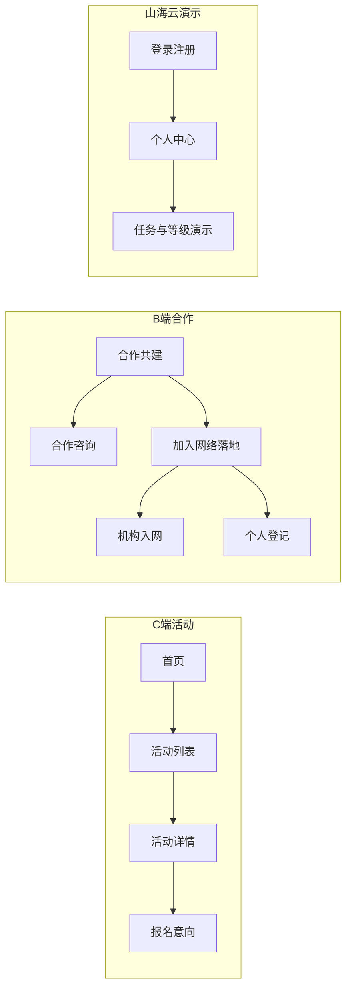

# TerraMar（山海自然教育）官网 — 产品总览 v1

文档版本：v1.0  
适用范围：`terramar-website`（React + Vite + Tailwind，当前以 mock 数据为主）  
与下列文档配合阅读，**不替代**其中范围与验收条款：

- [PRD_TerraMar_Web_MVP.md](./PRD_TerraMar_Web_MVP.md) — MVP 目标、漏斗、本期做/不做、v2 与山海云关系  
- [PRD_Shanhaiyun_Auth_Membership_v1.md](./PRD_Shanhaiyun_Auth_Membership_v1.md) — 登录、会员、贡献等级、分期  
- [API_Shanhaiyun_User_Membership_contract_v0.md](./API_Shanhaiyun_User_Membership_contract_v0.md) — 用户与会员 REST 契约（绿场）  
- [Map_Data_Platform_Design_v1.md](./Map_Data_Platform_Design_v1.md) — 地图数据与节点语义  
- [PRD_Account_Personal_Center_v1.md](./PRD_Account_Personal_Center_v1.md) — 个人中心 IA、课程订单五态、子路由规划  
- [PRD_TerraMar_Backend_Supabase_v1.md](./PRD_TerraMar_Backend_Supabase_v1.md) — 后端与数据（Supabase）：域模型、RLS、API 映射、分期验收与 mock 迁移  

---

## 1. 产品定位

**山海自然教育（TerraMar Expeditions）** 官网承担：

1. **品牌与信任**：向 C 端（家庭、成人、银发等）与 B 端（保护地、学校、机构）传递使命、安全与专业度。  
2. **活动转化**：活动列表 / 详情 → 报名意向（线索）→ 后续运营跟进。  
3. **合作与网络**：合作共建叙事 → 合作咨询线索；「加入自然教育网络」个人/机构登记流程。  
4. **公益与公民科学入口**：公益平台、公民科学计划在地图上叙事，并链入统一登记页。  
5. **山海云演示主线（v2 前置）**：在不上线真实后端的前提下，用 **本地演示账号** 预演登录、主身份、分轨等级、加入流与账户回跳、个人中心 Hub，便于与 [PRD_Shanhaiyun_Auth_Membership_v1.md](./PRD_Shanhaiyun_Auth_Membership_v1.md) 对齐验收。

**技术现实**：数据主要来自 `src/mock/`；线索与部分登记写入 `localStorage`；山海云 API 通过 `src/lib/api/shanhaiyun/` 占位与功能开关渐进接入（见 MVP PRD §3.4）。

---

## 2. 信息架构与路由

全站由 [`SiteLayout`](d:\TerraMar\terramar-website\src\components\layout\SiteLayout.tsx) 包裹：`AuthProvider` + 顶栏导航 + `Outlet` + 页脚。

### 2.1 主导航（顶栏）

| 文案 | 路径 | 说明 |
|------|------|------|
| 探索活动 | `/programs` | 活动列表 + 地图 Hero；筛选与卡片 |
| 合作共建 | `/cooperation` | B 端能力与合作叙事 + 地图 Hero |
| 公益行动 | `/impact` | 山海云公益平台 + 地图 Hero；CTA 链志愿登记 |
| 科研与公民科学 | `/science` | 公民科学计划 + 地图 Hero；物种上传入口 |
| 资源中心 | `/resources` | 轻量内容列表（mock） |
| 关于我们 | `/about` | 品牌与团队叙事（mock） |

首页：`/`（`HomePage`）。

### 2.2 账户与认证

| 路径 | 说明 |
|------|------|
| `/login` | 支持 `next` / `intent` / `entry` 回跳（[`joinRouting`](d:\TerraMar\terramar-website\src\lib\joinRouting.ts)） |
| `/register` | 按入口意图默认会员类型与主身份（活动/网络/公益/公民科学） |
| `/account` | 个人中心仪表板 + 山海云演示（[`AccountPage`](d:\TerraMar\terramar-website\src\pages\AccountPage.tsx) / [`AccountDashboard`](d:\TerraMar\terramar-website\src\pages\account\AccountDashboard.tsx)，[`AccountLayout`](d:\TerraMar\terramar-website\src\pages\account\AccountLayout.tsx) 侧栏与子路由） |
| `/account/orders`、`/account/orders/:orderId`、`profile`、`security`、`addresses`、`footprint`、`tasks`、`courses`、`wishlist`、`support` 等；`/account/cart` 重定向至 `wishlist`；未登录由布局层重定向登录并带回跳 |

顶栏：未登录显示「登录 / 注册」；已登录显示「账户 / 退出」（及移动端等价入口）。

### 2.3 加入网络与协作

| 路径 | 说明 |
|------|------|
| `/join-network` | 落地页：个人 vs 机构；支持 `?intent=activity` / `?intent=network`；未登录可一键登录回跳 |
| `/join-network/personal` | 个人登记（角色/定位/选点/表单）；`entry` 区分公益志愿与公民科学；`intent=activity` 与云主身份游客对齐 |
| `/cooperation/join-network` | 机构入网（定位 + 选点 + Lead）；已登录可在 `extra` 中带演示用户 id |

入口与意图（节选）：活动 CTA → `activityJoinPath`；合作 CTA → `networkJoinPath`；公益 / 公民科学 → `shanhaiyunVolunteerJoinPath`、`citizenScienceJoinPath`（见 `src/lib/shanhaiyunVolunteerLeads.ts`、`citizenScienceLeads.ts`）。

### 2.4 活动详情

| 路径 | 说明 |
|------|------|
| `/programs` | 列表 + 地图 Hero；「加入自然教育活动」带 `intent=activity` |
| `/programs/:slug` | 详情、行程、FAQ、侧栏报名 `LeadForm`；游客演示「完成本节学习 +1 课」 |

### 2.5 其他

- `/resources`、`/about`：内容与品牌补充。  
- `*`：[`NotFoundPage`](d:\TerraMar\terramar-website\src\pages\NotFoundPage.tsx)。

---

## 3. 核心用户旅程（摘要）

- **活动转化**：首页 / 地图 → 活动列表 → 详情 → `LeadForm`（`trackEvent` 埋点见 MVP PRD）。  
- **加入流 + 账号同步**：从各入口带 `intent` 或 `entry` 进入 → 未登录引导登录/注册并 `next` 回原 URL → 已登录个人用户按入口同步云主身份（游客/志愿者/公民科学家）。  
- **地图与记录**：科研地图页支持物种 mock 上传、动态节点；与账户「公民科学家」轨及物种条数演示联动（见 `MapUploadEntry`、`levelPolicy`）。

---

## 4. 体验与视觉设计要点

- **品牌色与版式**：CSS 变量（`--brand-primary`、`--bg-base` 等）+ `container-page`、`card`、`section-shell`；顶栏半透明胶囊 + 全站页脚深绿区（[`index.css`](d:\TerraMar\terramar-website\src\index.css)）。  
- **地图 Hero**：`MapHeroShell` + Leaflet 筛选/图层/抽屉；Programs / Cooperation / Impact / Science 四页复用不同 `page` 与 CTA。  
- **表单与账户**：`tm-*` 工具类用于登录/注册/账户表单区；个人中心 Hub 采用「订单五宫格 + 分组列表行」结构（见 [PRD_Account_Personal_Center_v1.md](./PRD_Account_Personal_Center_v1.md)）。  
- **无障碍与 UX**：列表行可聚焦、进度条 `aria-*`、订单态不完全依赖颜色；空状态与演示说明文案区分正式产品（UI 技能原则：教育类 SaaS、移动优先、加载/空/错状态）。

---

## 5. 山海云演示能力（当前实现摘要）

| 能力 | 实现要点 |
|------|----------|
| 会话 | `sessionStorage` 演示会话；用户表在 `localStorage`（[`mockAuthStore`](d:\TerraMar\terramar-website\src\lib\auth\mockAuthStore.ts)） |
| 会员类型 | 个人 / 机构；机构单档 ORG_MEMBER 叙事 |
| 主身份 | 游客 / 志愿者 / 公民科学家；账户页可自选（演示） |
| 分轨升级 | 游客课程数、志愿者时长、公民科学家物种条数；[`levelPolicy`](d:\TerraMar\terramar-website\src\lib\auth\levelPolicy.ts) 统一算等级与展示分 |
| 加入流对齐 | `joinRouting`：`safeNextPath`、`buildAuthHref`、活动/网络路径常量 |
| 个人中心 | Hub + `/account/:module` 占位；订单五态 slug 与 PRD 一致 |

正式环境与契约以后端与 [API 契约](./API_Shanhaiyun_User_Membership_contract_v0.md) 为准。

---

## 6. 线索与数据落盘（演示）

- **通用线索**：[`leads.ts`](d:\TerraMar\terramar-website\src\lib\leads.ts)（报名、合作等）。  
- **独立库**：公民科学、山海云公益志愿等独立 `localStorage` key，便于未来迁入山海云（见对应 `*Leads.ts`）。  
- **分析**：[`analytics`](d:\TerraMar\terramar-website\src\lib\analytics.ts) 事件名与 MVP 过程指标对应。

---

## 7. 分期与边界

| 阶段 | 官网侧 |
|------|--------|
| **MVP（v1）** | 品牌 + 活动 + 合作 + 轻资源 + 关于；mock；线索本地；地图叙事与留资（见 [PRD_TerraMar_Web_MVP.md](./PRD_TerraMar_Web_MVP.md)） |
| **演示增强（当前仓库）** | 山海云登录注册演示、加入流 `next`、个人中心 Hub、分轨等级、地图物种上传与动态节点 |
| **v2** | 功能开关打开后调用山海云 API；订单、地址、轨迹、客服等个人中心子模块对接（见个人中心 PRD P2） |

---

## 8. 文档与代码索引

| 类型 | 路径 |
|------|------|
| 路由 | `src/routes/router.tsx` |
| 布局与导航 | `src/components/layout/SiteLayout.tsx` |
| 地图壳层 | `src/components/map/MapHeroShell.tsx` |
| 认证上下文 | `src/lib/auth/AuthContext.tsx` |
| 加入路由工具 | `src/lib/joinRouting.ts` |
| 个人中心布局 / 仪表板 | `src/pages/account/AccountLayout.tsx`、`src/pages/account/AccountDashboard.tsx` |
| 个人中心子页 | `src/pages/account/modules/*.tsx` |

---

## 9. 修订记录

| 版本 | 日期 | 说明 |
|------|------|------|
| v1.0 | 2026-05 | 初稿：站点产品总览，交叉引用 MVP 与山海云及个人中心 PRD |
