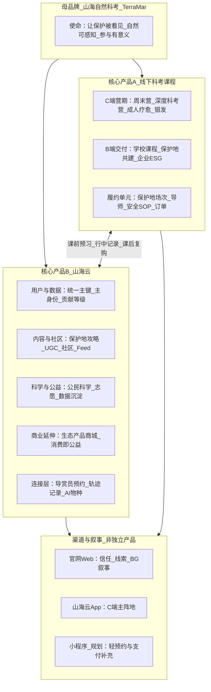
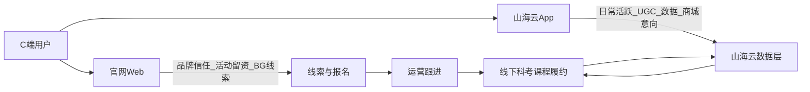
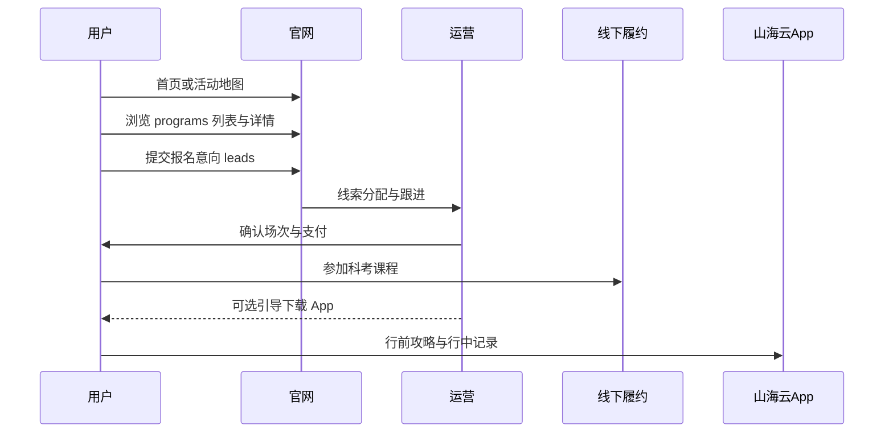
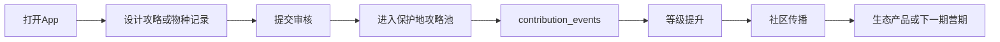
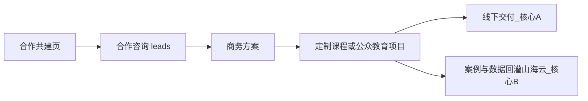

# TerraMar 产品架构说明 v1

文档版本：v1.0  
适用范围：产品、运营、设计、前后端研发、对外合作话术  
文档性质：**概念层产品架构**（归纳现有 PRD，不替代各 PRD 的范围与验收条款）

> **产品线主框架（v2）**：双核心 + **六条产品线**（课程/导师/文创 · 科研/攻略/成长档案）+ Phase1 钱江源 / Phase2 复制，见 **[PRODUCT_Framework_v2.md](../terramar_app/docs/PRODUCT_Framework_v2.md)**。本文 v1 保留 PRD 触点、模块地图与三端分工索引。

**关联 PRD（详细规格以各文档为准）**

| 文档 | 路径 |
|------|------|
| 官网产品总览 | [PRD_TerraMar_Web_Product_Overview_v1.md](./PRD_TerraMar_Web_Product_Overview_v1.md) |
| 官网 MVP | [PRD_TerraMar_Web_MVP.md](./PRD_TerraMar_Web_MVP.md) |
| 山海云 App | [../terramar_app/docs/PRD_Shanhaiyun_App_v1.md](../terramar_app/docs/PRD_Shanhaiyun_App_v1.md) |
| 山海云登录与会员 | [PRD_Shanhaiyun_Auth_Membership_v1.md](./PRD_Shanhaiyun_Auth_Membership_v1.md) |
| 后端 Supabase | [PRD_TerraMar_Backend_Supabase_v1.md](./PRD_TerraMar_Backend_Supabase_v1.md) |
| 地图数据平台 | [Map_Data_Platform_Design_v1.md](./Map_Data_Platform_Design_v1.md) |
| 个人中心 | [PRD_Account_Personal_Center_v1.md](./PRD_Account_Personal_Center_v1.md) |
| 独立市场调研（自然保护地研学） | [../terramar_app/docs/MARKET_INSIGHTS_Nature_Experience_Study_2026.md](../terramar_app/docs/MARKET_INSIGHTS_Nature_Experience_Study_2026.md) |
| 核心产品与差异化（战略摘要） | [../terramar_app/docs/PRODUCT_Core_and_Differentiation_v1.md](../terramar_app/docs/PRODUCT_Core_and_Differentiation_v1.md) |
| **产品架构整合逻辑图** | [../terramar_app/docs/PRODUCT_Architecture_Logic_Diagram_v1.md](../terramar_app/docs/PRODUCT_Architecture_Logic_Diagram_v1.md) |
| **产品框架 v2（主框架）** | [../terramar_app/docs/PRODUCT_Framework_v2.md](../terramar_app/docs/PRODUCT_Framework_v2.md) |

**商业计划书**：战略摘要见 [App PRD §1.2](../terramar_app/docs/PRD_Shanhaiyun_App_v1.md#12-与机构战略对齐商业计划书摘要)。原文 [`terramar_app/assets/商业计划书.docx`](../terramar_app/assets/商业计划书.docx) 若未入库，以 PRD 摘要及本文 §11 待填锚点为准。

---

## 1. 文档目的与读者

### 1.1 目的

解决当前产品体系「看起来有很多并列产品」的混乱感，用 **双核心 + 分层** 统一对内对外表述：

- **核心产品 A**：线下科考课程（交付型）
- **核心产品 B**：山海云（平台型）

官网四栏导航、App 五个 Tab、生态商城、导赏预约等，均归入 **渠道、模块或能力**，不与两大核心平级。

### 1.2 读者

| 角色 | 建议阅读章节 |
|------|----------------|
| 创始人 / 产品 | 全文；重点 §2–§4、§8 |
| 运营 / 商务 | §3、§7、§8、§10 |
| 设计 / 前端 | §4–§6、§9 |
| 合作方 / 投资沟通 | §2、§3、§8、§10 |

### 1.3 与 PRD 的关系

- 本文 **不修改** 各 PRD 已承诺的 MVP / P0 范围与历史「本期不做」表述。
- 出现冲突时，以具体 PRD 的验收条款为准；本文仅提供 **架构视角的归类与命名**。

---

## 2. 母品牌与使命

### 2.1 品牌命名

| 名称 | 用途 |
|------|------|
| **山海自然科考** | 建议作为母品牌主称（与 App PRD、商业计划书一致） |
| **TerraMar Expeditions** | 英文品牌名 |
| **山海自然教育** | 对外兼容别名；官网部分文案仍使用，架构上视为同一机构 |

### 2.2 使命与机构定位（商业计划书摘要）

| 维度 | 内容 |
|------|------|
| 使命 | 让保护被看见，让自然可感知，让参与有意义 |
| 机构定位 | 科考级自然体验 + **山海云数字中枢** + 保护地社区受益与公众生态意识提升 |
| 山海云使命 | 攻略 / 数据 / 故事共享；公益反哺透明公示；标准化跨区域复制 |
| 首站示范 | 钱江源（长三角）；后续「城市—保护地双核」与多核扩展 |
| 差异化 | 集探索、记录、分享、学习、社区反哺于一体 |

### 2.3 机构级核心指标（双核心共同承载）

服务人次、机构/保护地数、志愿者与公民科学家规模、有效物种记录数、攻略数、生态产品销量、反哺金额（详见 App PRD §1.2）。

---

## 3. 双核心产品定义

### 3.1 一句话定义

| 核心产品 | 定义 |
|----------|------|
| **线下科考课程** | 在保护地真实场景中交付的、有排期与履约的 **科考级自然教育产品**（营收与品牌主锚） |
| **山海云** | 贯穿用户身份、内容、数据与社区反哺的 **数字中枢**（留存、复购、公民科学与「消费即公益」的承载平台） |

**二者关系**：课程负责「把人带到场并深度交付」；山海云负责「把人留在场域网络里并持续产生价值」。是 **交付 + 平台** 双轮，而非互相替代。

### 3.2 对比表

| 维度 | 线下科考课程 | 山海云 |
|------|----------------|--------|
| 产品形态 | 营期 / 场次（有时间、地点、导师、安全 SOP） | 账号、内容、数据、社区、商城意向的一体化平台 |
| 主要营收 | 营期学费、B 端定制项目 | 生态产品、导赏服务（规划）、长期会员/路径（待运营） |
| 主要触点 | 官网 `/programs`、运营跟进、线下履约 | 山海云 App（C 端主阵地）；官网账户与登记为辅助客户端 |
| 成功指标侧重 | 服务人次、满员率、复购、NPS、B 端合同 | MAU、攻略数、物种记录、UGC、反哺金额 |
| 数据落点（正式环境） | `orders`、`platform_exploration_enrollments`、`leads` | `profiles`、`contribution_events`、攻略/物种/社区等业务表 |
| 不是什么 | 单次浏览攻略、社区发帖 | 第四个「科考营 SKU」；官网四条导航本身 |

### 3.3 产品分层总图

> **整合逻辑图**（双核心 hub + 环绕层 + 数据流 + 保护地三线）：见 [PRODUCT_Architecture_Logic_Diagram_v1.md](../terramar_app/docs/PRODUCT_Architecture_Logic_Diagram_v1.md)  
> **v2 六产品线主框架**：见 [PRODUCT_Framework_v2.md](../terramar_app/docs/PRODUCT_Framework_v2.md)

### 3.4 v1 概念 → v2 六条产品线（对照）

| v1 本文组织方式 | v2 产品线（[Framework v2](../terramar_app/docs/PRODUCT_Framework_v2.md)） |
|-----------------|------------------------------------------------------------------------|
| 核心 A · 线下科考课程 | L1 核心 A；L2 **课程产品** |
| C 端 SKU 梯度（weekend / camp / healing…） | **课程产品** 内部分型 |
| B 端学校 / 保护地 / ESG 定制 | **课程产品** + **导师培训** |
| 核心 B · 山海云 | L1 核心 B |
| 自然体验 / 设计攻略 Tab | L2 **攻略产品** |
| 公民科学 Tab / 物种地图 | L2 **科研产品** |
| 主身份 / 贡献等级 / 我的 | L2 **用户成长档案** |
| 生态产品商城 | L2 **文创产品** |
| 导赏员预约 | **攻略产品** 履约 ← **导师培训** 产出 |
| 官网四栏 / App Tab | L3 触点（非产品线） |

---

## 4. 核心产品 A：线下科考课程

### 4.1 产品内涵

| 维度 | 说明 |
|------|------|
| 卖什么 | 有明确时间、地点、人群、强度、导师的 **营期 / 场次** |
| 对谁 | C 端：亲子家庭、自然兴趣成人、银发；B 端：学校、保护地、企业 ESG（定制交付） |
| 转化路径 | 官网 `/programs` → `/programs/:slug` → 报名意向（`leads`）→ 运营确认 → 订单与履约（`orders` / `platform_exploration_enrollments`） |
| 系统落点 | 见 [PRD_TerraMar_Backend_Supabase_v1.md](./PRD_TerraMar_Backend_Supabase_v1.md) §4.5 |

### 4.2 课程产品矩阵

沿用官网 MVP 的 **四档梯度**（引流 / 利润 / 品牌 / 长期），映射 SKU **类型**（`programs.type`）与人群：

| 梯度 | 商业角色 | 典型形态 | `type` 示例 | 现有 mock 示例 |
|------|----------|----------|---------------|----------------|
| 引流 | 低门槛获客 | 半日 / 周末体验 | `half_day`、`weekend` | 城市半日观鸟入门；钱江源周末亲子自然营 |
| 利润 | 主力营收 | 多日科考营 | `camp` | 夏季五天四晚生态科考营 |
| 品牌 | 差异化与口碑 | 成人深度 / 疗愈 | `adult_healing` | 成人自然学习与疗愈周末 |
| 长期 | 复购与粘性 | 系列课 / 会员路径 | 待运营定义 | 可与山海云贡献等级、长期营期联动 |
| 交叉 | 科研与数据向 | 公民科学场次（仍属线下交付） | `citizen_science` | 公民科学溪流水质监测日 |

**人群与强度**（列表筛选维度，与 App 攻略维度对齐）：亲子 / 成人 / 银发；`intensity`：low / medium / high。

### 4.3 B 端交付（同属核心产品 A）

B/G 合作不单独列为「第三大核心产品」，而是通过 **合作共建** 通道获客，交付物多为 **定制课程包或公众教育项目**：

| 合作方向（官网叙事） | 典型交付物 |
|----------------------|------------|
| 学校课程合作 | 校本课程、研学执行、自然教室共建 |
| 保护地共建 | 课程研发、讲解员培训、开放日活动 |
| 企业 ESG | 员工自然疗愈团建、公益联名项目 |
| 高校 / 科研 | 联合课题、实习基地、公民科学数据共建 |

详见合作页设计规格与 [Map_Data_Platform_Design_v1.md](./Map_Data_Platform_Design_v1.md) §1.2。

### 4.4 明确边界：不属于「课程」的能力

以下能力归属 **山海云**，可作为课前预习、行中记录或课后延伸，**不**算作与「线下科考课程」平级的核心产品：

- App 内自由浏览的保护地与自然体验攻略
- 社区帖、竖滑 Feed
- 轨迹记录、物种随手拍（未绑定具体营期场次时）
- 生态产品在线浏览与购买意向

参营用户完成营期后，可通过 `contribution_events`（如「探索活动课程完成 +20 / 次」）与山海云等级体系联动（见会员 PRD、后端 PRD）。

---

## 5. 核心产品 B：山海云

### 5.1 平台内涵

| 维度 | 说明 |
|------|------|
| 是什么 | 用户主键 + 行为数据 + 保护地攻略 + UGC 社区 + 公民科学 + 生态商城的 **一体化数字平台** |
| 不是什么 | 不是官网顶栏四条导航的集合名；不是第五个科考营 SKU |
| 数据权威 | 正式环境以 **山海云用户主键** 贯穿；官网与 App 均为客户端，不作业务权威源（见 [PRD_Shanhaiyun_Auth_Membership_v1.md](./PRD_Shanhaiyun_Auth_Membership_v1.md) §2.1） |
| 愿景（会员 PRD） | 身份、会员画像、行为与业务数据均在登录后沉淀于山海云 |

### 5.2 用户与身份模型（摘要）

| 概念 | 说明 |
|------|------|
| 主身份 | `游客`（默认）/ `志愿者` / `公民科学家` — 参与方式与权限边界 |
| 会员等级 | 与主身份 **解耦**；由 `contribution_events` 累计贡献分映射等级 |
| 机构会员 | 单档 `ORG_MEMBER`；差异由机构档案承载 |
| 解锁路径 | 志愿者 / 公民科学家：官网 `/join-network/personal?entry=…` 登记，写入山海云业务表 |

课程完成、物种记录、志愿时长等均可作为贡献事件来源（见会员 PRD §3.1、§4.3）。

### 5.3 山海云模块地图（App）

对外统一表述为 **「山海云平台的六个功能模块」**（含发现首页），避免说成「五个 App 产品」。

| 模块 | App 路由 / Tab | 角色 | 与线下课程的关系 |
|------|----------------|------|------------------|
| 发现首页 | `/discover` | 聚合入口；生态产品横滑 + 推荐 Feed | 营期结束后的复购、公益消费、品牌内容触达 |
| 自然体验 | `/nature` | 保护地列表；攻略浏览；导赏员预约 | 课前选线、课后重访；可向营期或导赏导流 |
| 设计攻略 | `/design` | 轨迹记录；AI 物种（mock/P2）；UGC 上传至保护地攻略池 | 行中/行后记录；数据沉淀与科研候选 |
| 互动社区 | `/community` | UGC 图文/视频；点赞评论 | 青年客群运营；引流至保护地/攻略 |
| 公民科学 | `/science` | 项目列表；物种地图；与官网 `/science` 语义对齐 | 与科研叙事、主身份「公民科学家」联动 |
| 我的 | `/me` | 账户、等级、订单、足迹（规划） | 课程订单与个人中心统一入口 |

**自然体验攻略 vs 设计攻略**（App PRD §2.3）：

| 模块 | 层级 | 说明 |
|------|------|------|
| 自然体验攻略 | 浏览层 | 隶属某一保护地；官方 + 审核通过 UGC |
| 设计攻略 Tab | 创作层 | 轨迹记录 → 编辑 → 上传至指定保护地攻略池 |

### 5.4 生态产品商城（山海云子模块，非第三核心）

- **定位**：山海云下的 **商业化与社区反哺模块**（商业计划书 §1.5.1：社区生态产品在线商城、消费即公益）。
- **展示**：App 发现页顶部横滑；字段含价格、保护地/社区标签、反哺说明（如「收益 30% 支持 XX 社区」）。
- **数据实体**：`eco_product`（App PRD §5.1）；正式订单见 `orders`（P2，含课程与生态产品）。
- **边界**：不是与「科考课程」「山海云」并列的第三大核心产品。

### 5.5 逻辑实体与后端映射（摘要）

| 山海云逻辑实体 | 后端 / 官网能力 | 备注 |
|----------------|-----------------|------|
| `user_profile` | `auth.users` + `profiles` | API 契约 |
| `experience_guide` | P1 新建 App 业务表或 BFF | P0 mock |
| `species_record` | `platform_species_records` | 地图公开读点 |
| 探索活动报名 | `platform_exploration_enrollments` | `catalog_slug` 对齐 `/programs/:slug` |
| 公民科学参与 | `platform_citizen_science_enrollments` | 对齐 `scienceProjects.slug` |
| 公益参与 | `platform_welfare_enrollments` | 与 `/impact` 联动 |
| 线索 / 预约意向 | `leads` | 导赏、商品意向 P1 |
| 订单 | `orders` | 课程 / 生态产品 P2 |

完整映射见 [App PRD §6](../terramar_app/docs/PRD_Shanhaiyun_App_v1.md#6-app--官网--supabase-映射表)。

---

## 6. 官网信息架构：通道而非并列产品

官网顶栏四条业务线 + 资源/关于，在架构上属于 **同一母品牌下的获客与叙事通道**，分别导向双核心或登记流：

| 官网导航 | 路径 | 架构归类 | 导向的核心产品 / 能力 |
|----------|------|----------|------------------------|
| 探索活动 | `/programs` | **C 端课程获客主通道** | 核心产品 A：线下科考课程 |
| 合作共建 | `/cooperation` | **B/G 获客通道** | 定制课程或平台合作 → A 或 B |
| 公益行动 | `/impact` | **使命叙事 + 志愿入口** | 山海云主身份「志愿者」 |
| 科研与公民科学 | `/science` | **科研叙事 + 登记入口** | 山海云「公民科学家」与数据能力 |
| 资源中心 | `/resources` | 品牌内容 | 信任支撑，非独立产品 |
| 关于我们 | `/about` | 品牌内容 | 信任支撑，非独立产品 |

四页首屏 **MapHero** 地图为统一叙事组件（活动 / 合作 / 公益 / 科研四条线的数据可视化入口），见 [Map_Data_Platform_Design_v1.md](./Map_Data_Platform_Design_v1.md)。

### 6.1 其他官网路径归类

| 路径 | 归类 | 说明 |
|------|------|------|
| `/login`、`/register` | 山海云账户通道 | `next` / `intent` / `entry` 回跳 |
| `/account` 及子路由 | 山海云个人中心（Web 端） | 订单五态、任务与等级演示 |
| `/join-network` | 供给侧 / 生态伙伴注册 | 个人 vs 机构；非 C 端课程 SKU |
| `/join-network/personal` | 身份登记 | `entry` 区分志愿与公民科学 |
| `/programs/:slug` | 课程详情 + 转化 | `LeadForm` 报名意向 |

### 6.2 常见误解对照

| 现状呈现 | 常见误解 | 正确归类 |
|----------|----------|----------|
| 官网四栏 | 四个并列产品 | 四条获客与叙事通道 |
| App 五 Tab + 发现 | 六个 App 产品 | 山海云平台的功能模块 |
| 生态产品横滑 | 独立电商产品线 | 山海云商业化子模块 |
| 导赏员预约 | OTA 平台 | 山海云内容与履约能力；可导流课程 |
| 公益平台 / 科研平台 | 与课程平级的产品线 | 通道 + 山海云身份/数据能力 |

---

## 7. 三端分工

| 端 | 核心职责 | 核心产品侧重 | 现状（仓库） |
|----|----------|----------------|--------------|
| **官网 Web** | 品牌信任；活动转化；合作/公益/科研叙事；登记与线索 | **课程**为主（线索） | `terramar-website` |
| **山海云 App** | 发现、记录、分享、购买意向、公民科学、社交 | **山海云**为主（留存与数据） | `terramar_app`（P0 Mock） |
| **小程序（规划）** | 轻量分享、活动预约、支付补充 | 双核心的触达延伸 | 未实现 |

**数据流原则**：正式环境用户行为以山海云主键写入；官网演示期可用 `localStorage` 降级（见官网产品总览 §5、§6）。

### 7.1 运营后台（官网 CMS）

官网另设内部渠道 **`/admin`**：面向运营/内容编辑，**不是**第四个 C 端产品。

| 项 | 说明 |
|----|------|
| 技术 | 与官网同仓 React；内容存 Supabase（`site_*` / `team_members` / `cms_*` / `hero_media`）；`profiles.is_staff` 鉴权 |
| 能力 | 文案、团队、活动目录、资源文章、媒体、Hero 视频、线索、地图点位、UGC 审核、审计日志 |
| 发布 | 保存草稿 / 发布后官网运行时读取，无需为改文案发版 |
| 文档 | [CMS_Admin_Guide_v1.md](./CMS_Admin_Guide_v1.md) |

---

## 8. 关键用户旅程（三条主路径）

### 8.1 路径一：获客 → 参营（课程主导）

**关键触点**：`/programs` → `/programs/:slug` → `LeadForm` → `orders` / `platform_exploration_enrollments`。

### 8.2 路径二：活跃 → 沉淀（山海云主导）

**闭环表述**（App PRD §4.3）：社区内容 → 保护地/攻略 → 设计攻略或公民科学上传 → 贡献度提升 → 个人主页与消息 → 商城或营期转化。

### 8.3 路径三：合作 → 交付（B/G，课程或平台定制）

机构入网：`/cooperation/join-network` → 机构档案与 `ORG_MEMBER`（见会员 PRD §3.2、§4.4）。

---

## 9. 架构概念 ↔ PRD 对照索引

| 架构概念 | 主要 PRD | 章节 / 落点 |
|----------|----------|-------------|
| 母品牌与使命 | App PRD | §1.2 |
| 线下科考课程 / 探索活动 | Web MVP、Web 产品总览 | MVP §7.2–7.3；总览 §2.1 `/programs` |
| 课程梯度（引流/利润/品牌/长期） | Web MVP | §7.1 D |
| 山海云平台定义 | App PRD、Auth 会员 PRD | App §1；Auth §2 |
| App 模块 IA | App PRD、App 线框说明 | §2、§3 |
| 生态产品商城 | App PRD | §3.1.1、§5.1 `eco_product` |
| 官网四栏地图 | Map 数据平台设计 | §1–§3 |
| 用户主键与主身份 | Auth 会员 PRD、API 契约 | Auth §2–§3 |
| 贡献等级与课程事件 | Auth §3.1、Backend §4 | `contribution_events`、课程完成 +20 |
| 订单与报名 | Backend、个人中心 PRD | `orders`、`platform_exploration_enrollments` |
| 三端分工 | App PRD §1.3、本文 §7 | — |
| 合作 / 公益 / 科研通道 | Web 总览 §2.1、合作页设计规格 | `/cooperation`、`/impact`、`/science` |

---

## 10. 术语表与对外话术

### 10.1 术语表

| 术语 | 含义 |
|------|------|
| 线下科考课程 | 有排期履约的营期产品；官网亦称「探索活动」 |
| 山海云 | 数字中枢平台；含 App、账户、数据与商城等能力 |
| 山海云 App | C 端主阵地客户端，全名可用「山海云 App（山海自然科考）」 |
| 自然体验攻略 | 保护地下的浏览型路线内容（官方 + UGC） |
| 设计攻略 | 用户轨迹创作并上传至攻略池的流程与 Tab |
| 生态产品 | 保护地社区物产等；消费即公益；属山海云子模块 |
| 主身份 | 游客 / 志愿者 / 公民科学家 |
| 贡献等级 | 与主身份解耦的荣誉与权益层级 |
| 线索 `leads` | 报名意向、合作咨询等未成交前的留资 |
| 通道 | 官网导航级入口，用于获客或叙事，非独立产品线 |

### 10.2 建议统一口径

| 场景 | 建议说法 |
|------|----------|
| 机构介绍 | 我们是 **山海自然科考（TerraMar）**，两大核心产品是 **线下科考课程** 与 **山海云** |
| 官网「探索活动」 | 对外可保留导航文案；对内说明即 **科考课程列表** |
| App 介绍 | **山海云 App** 是山海自然科考的 C 端数字平台，不是六个独立 App |
| 生态商城 | **山海云上的社区生态产品**，支持保护地社区反哺 |
| 公益 / 科研页 | **山海云公益与公民科学入口**（官网通道），不是第三个平台品牌 |

### 10.3 「不要说」清单（防混乱）

- 不要说「我们有四个产品线：活动、合作、公益、科研」→ 应说 **四条官网通道**。
- 不要说「App 有五个产品」→ 应说 **山海云五个（加发现为六个）功能模块**。
- 不要把 **生态产品商城** 说成与科考课程、山海云并列的 **第三大核心产品**。
- 不要把 **自然体验攻略 / 导赏预约** 说成独立的 OTA 或内容公司产品线 → 属 **山海云能力**。
- 不要混用「山海自然教育」与「山海自然科考」而未说明二者为 **同一机构** 的别名关系。

---

## 11. 商业计划书原文锚点（待补充）

以下内容在 PRD 中以摘要形式出现；待 `商业计划书.docx` 纳入仓库后，可将本节替换为与原文逐条对齐的表格。

| 商业计划书章节（引用自 App PRD） | 架构落点 |
|--------------------------------|----------|
| §1.4.1 青年自然爱好者 / UGC | 山海云 · 互动社区、设计攻略 |
| §1.5.1 社区生态产品在线商城 | 山海云 · 生态产品子模块（§5.4） |
| 机构定位：科考级体验 + 数字中枢 | §3 双核心 |
| 钱江源首站、城市—保护地双核 | 课程 SKU 地点；App 保护地 mock |
| B/C/G 并行 | 核心 A（C/B）+ 官网通道 + 山海云 |

**待填**：创始人可将商业计划书 §1.4、§1.5 全文粘贴至本节，并核对是否与 §4–§5 矩阵一致。

---

## 12. 修订记录

| 版本 | 日期 | 说明 |
|------|------|------|
| v1.0 | 2026-05 | 初稿：双核心架构、通道/模块归类、三端分工、旅程与 PRD 索引 |

---

## 附录：2 分钟自检清单

读完本文后，应能回答：

1. **两个核心产品是什么？** 线下科考课程（交付型）、山海云（平台型）。  
2. **二者如何协作？** 课程把人带到场；山海云负责留存、数据、UGC 与复购。  
3. **官网四栏是什么？** 获客与叙事通道，不是四个平级产品。  
4. **App Tab 是什么？** 山海云平台的功能模块。  
5. **生态产品、导赏、攻略算不算第三个核心产品？** 否；属山海云模块或课程延伸能力。
